# Maldet GUI Quick Illustrated Guide

This guide presents the basic workflow of the Linux Malware Detect (Maldet)
Web interface. The screenshots show the interface in **English**.

## 1. Access and dashboard

Open the URL configured by the administrator (by default,
`http://127.0.0.1:8080`). On the **Dashboard**, check the Maldet version,
signature set, active scan count, monitor status, and server resources.

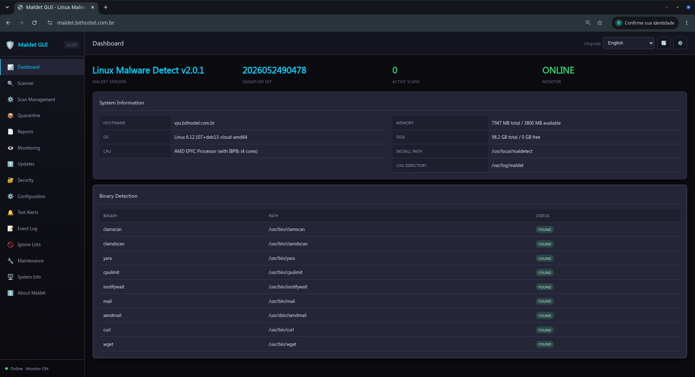

The dashboard also reports available binaries, including `clamscan`,
`clamdscan`, `yara`, and `inotifywait`. A `FOUND` status means the component
was detected.

## 2. Run a scan

1. Open **Scanner** in the side menu.
2. Enter the directory to analyze.
3. Select the scan type and configure exclusions if needed.
4. Start the scan and note the generated scan ID.

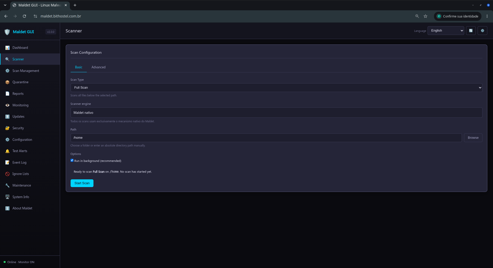

Background scans appear in **Scan Management**.

## 3. Monitor and control scans

**Scan Management** lists processes that are actually running, their PIDs,
state, and progress. Use **Pause**, **Continue**, or **Stop** as needed. Use
**Kill** only when a process is unresponsive.

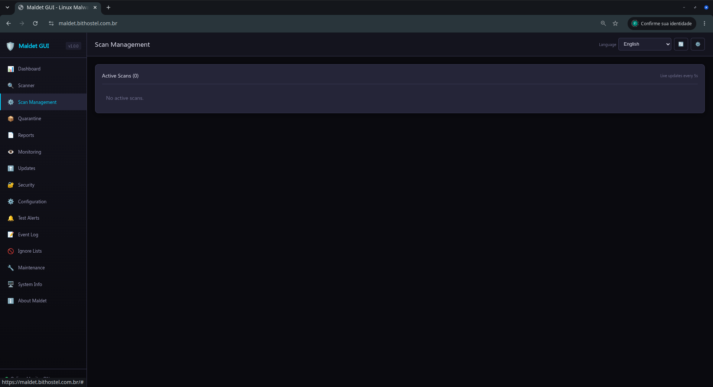

After a scan finishes, open **Reports** to review its result. A process that
no longer exists must not remain counted as active; refresh the page if the
server was restarted or the connection was interrupted.

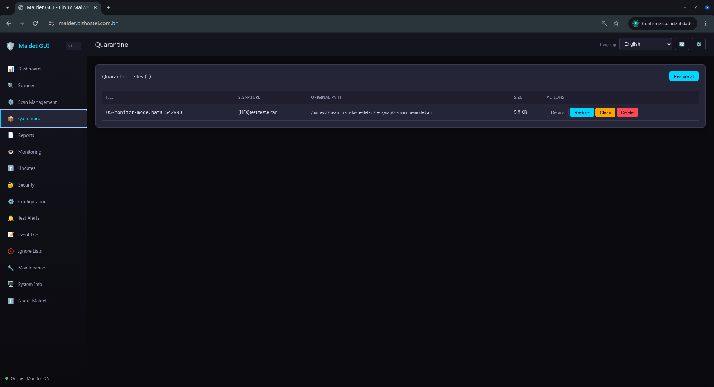

## 4. Quarantine and reports

**Quarantine** lists files isolated by Maldet. Restore an item only after
confirming that it is legitimate. Use bulk operations carefully.

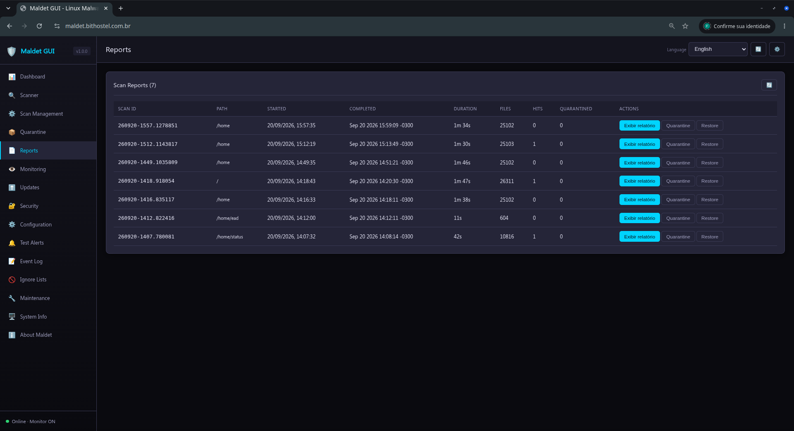

In **Reports**, select a scan to review analyzed files, detections, actions,
and completion time.

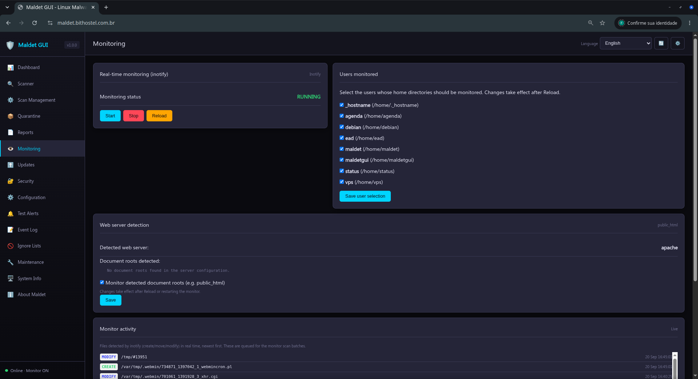

## 5. Monitoring and updates

**Monitoring** controls the inotify monitor and the watched paths. Use this
page to start, stop, or reload monitoring.

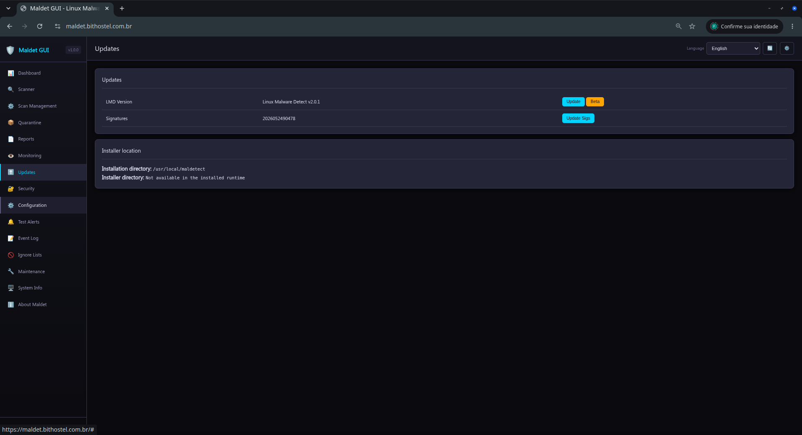

In **Updates**, update Maldet signatures and, when available, the ClamAV
database. Wait for the completion message before closing the page.

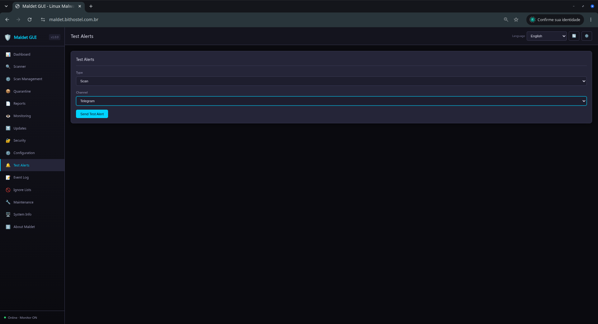

## 6. Security, configuration, and alerts

Use **Security** to review and adjust access controls. In **Configuration**,
change only known options; worker, CPU/IO limit, engine, and alert changes may
significantly affect server resource usage.

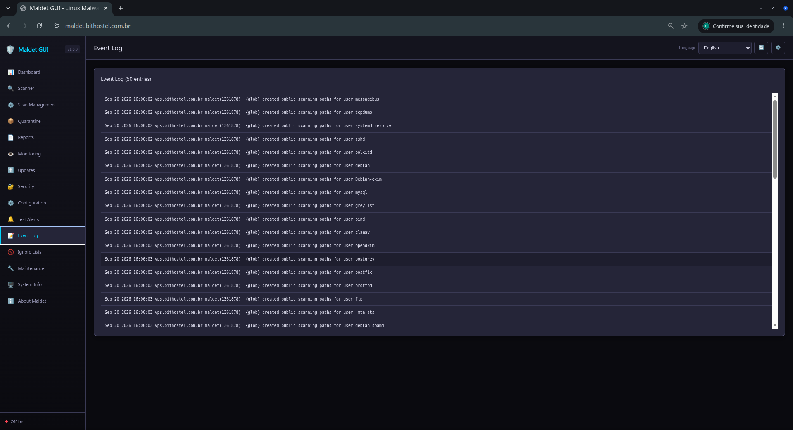

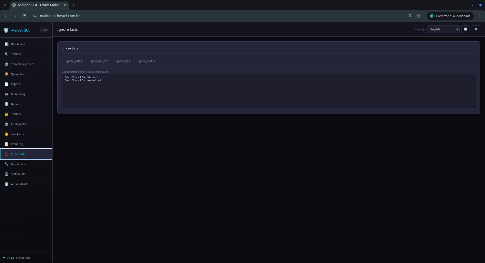

In **Test Alerts**, select a channel and send a test notification. Never
include tokens or passwords in screenshots, logs, or support requests.

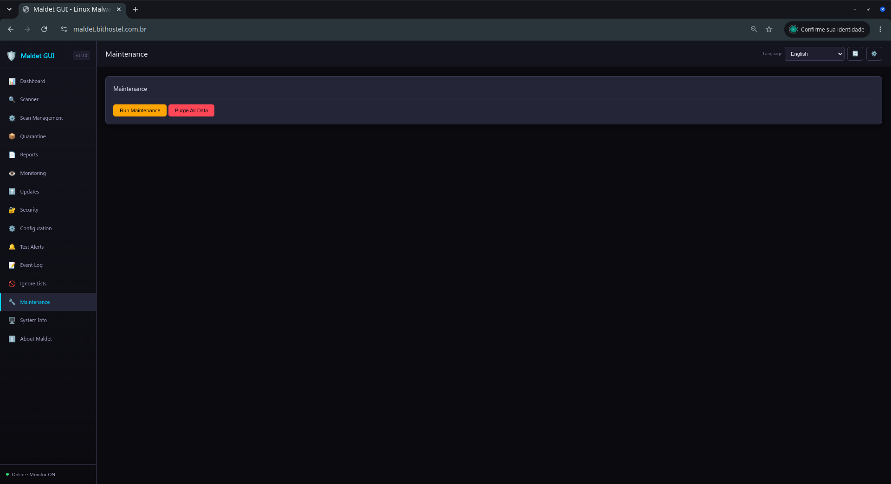

## 7. Logs, ignore lists, and maintenance

The **Event Log** helps diagnose scan starts and completion, alerts, errors,
and updates.

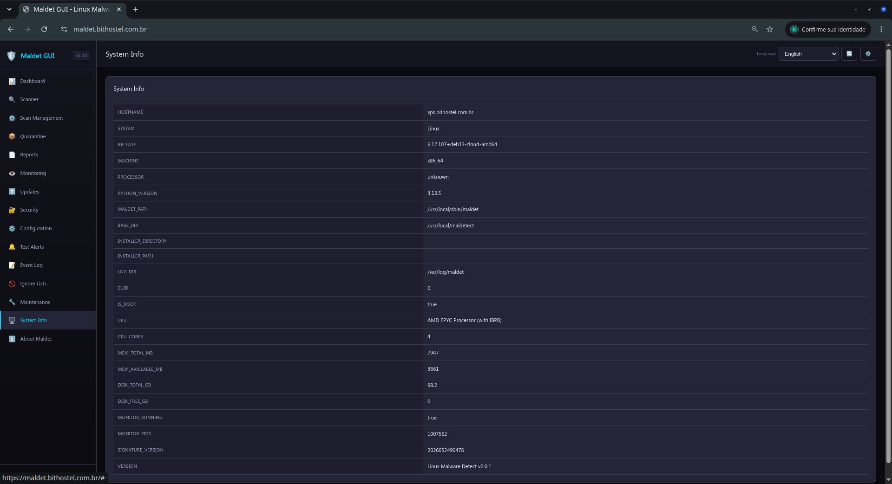

Use **Ignore Lists** for paths, extensions, or specific rules. Prefer narrow
rules so that valid detections are not hidden.

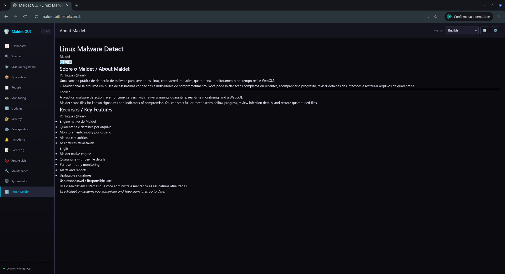

**Maintenance** organizes history files, removes stale metadata, compresses
old sessions, and archives older sessions. It does not start scans or
automatically remove legitimate files from quarantine.

## 8. System information and troubleshooting

**System Info** shows the hostname, operating system, CPU, memory, disk,
installation paths, and detected commands. Use this information when
investigating a failure or requesting support.

If the interface remains on a loading screen, perform a hard refresh
(`Ctrl+F5`), check `/api/check`, and review the launcher log. For remote
access, use a reverse proxy with authentication and TLS; do not expose the
GUI port directly to the Internet.
