# Manual rápido da Maldet GUI

Este manual apresenta o fluxo básico da interface Web do Linux Malware
Detect (Maldet). As capturas mostram a navegação em **Português (Brasil)**.

## 1. Acesso e painel

Abra a URL configurada pelo administrador (por padrão,
`http://127.0.0.1:8080`). No **Painel**, confira a versão do Maldet, o
conjunto de assinaturas, a quantidade de scans ativos, o monitor e os
recursos do servidor.

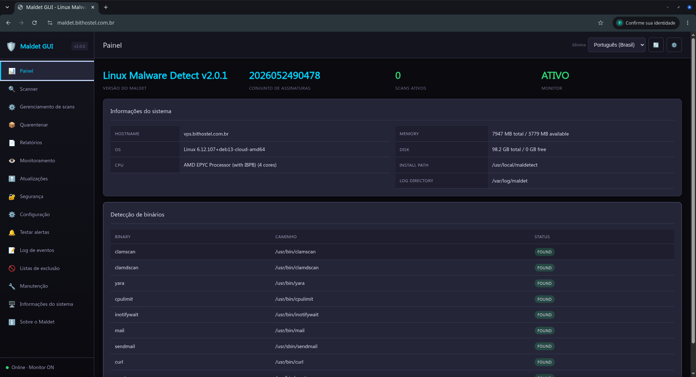

O painel também mostra a detecção dos binários disponíveis, incluindo
`clamscan`, `clamdscan`, `yara` e `inotifywait`. O status `FOUND` indica que o
componente foi localizado.

## 2. Executar um scan

1. Abra **Scanner** no menu lateral.
2. Informe o diretório a ser analisado.
3. Escolha o tipo de scan e, se necessário, configure exclusões.
4. Inicie a execução e acompanhe o identificador gerado.

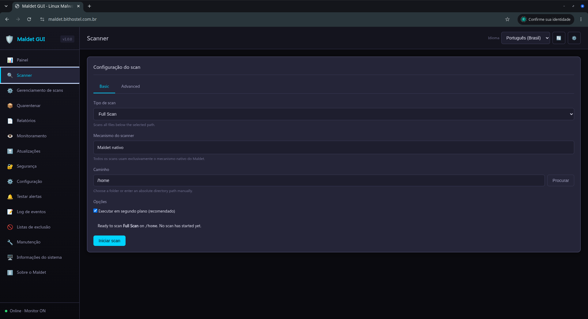

Scans iniciados em segundo plano aparecem em **Gerenciamento de scans**.

## 3. Acompanhar e controlar scans

Em **Gerenciamento de scans**, veja somente os processos realmente ativos,
seus PIDs, estado e progresso. Use **Pausar**, **Continuar** ou **Parar**
conforme a necessidade. Use **Kill** apenas quando o processo não responder.

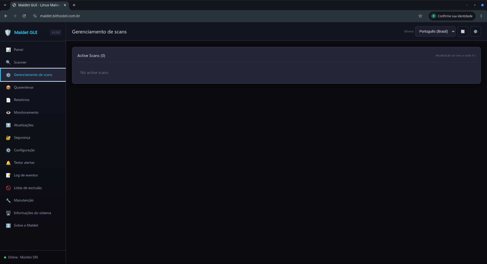

Após a conclusão, consulte o resultado em **Relatórios**. Um processo que já
não existe não deve continuar contado como ativo; atualize a tela se o
servidor tiver sido reiniciado ou se a conexão tiver sido interrompida.

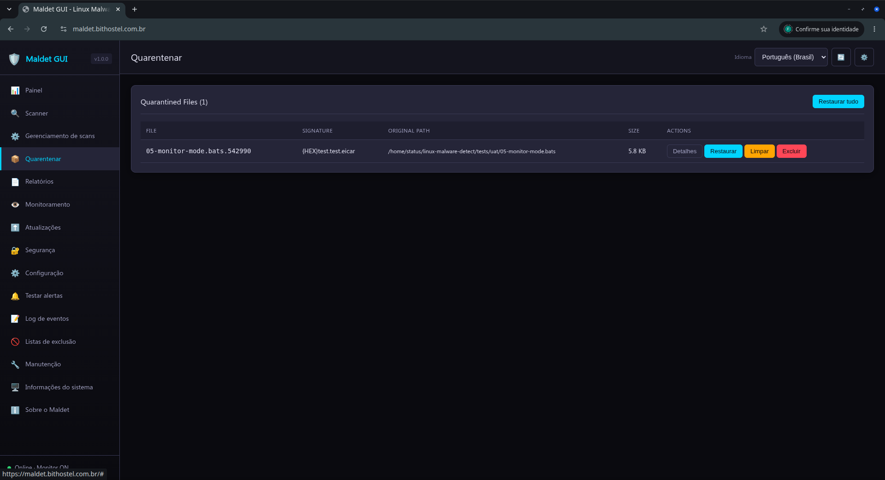

## 4. Quarentena e relatórios

**Quarentena** lista os arquivos isolados pelo Maldet. Restaure um item
somente depois de confirmar que ele é legítimo. Operações em massa devem ser
usadas com cautela.

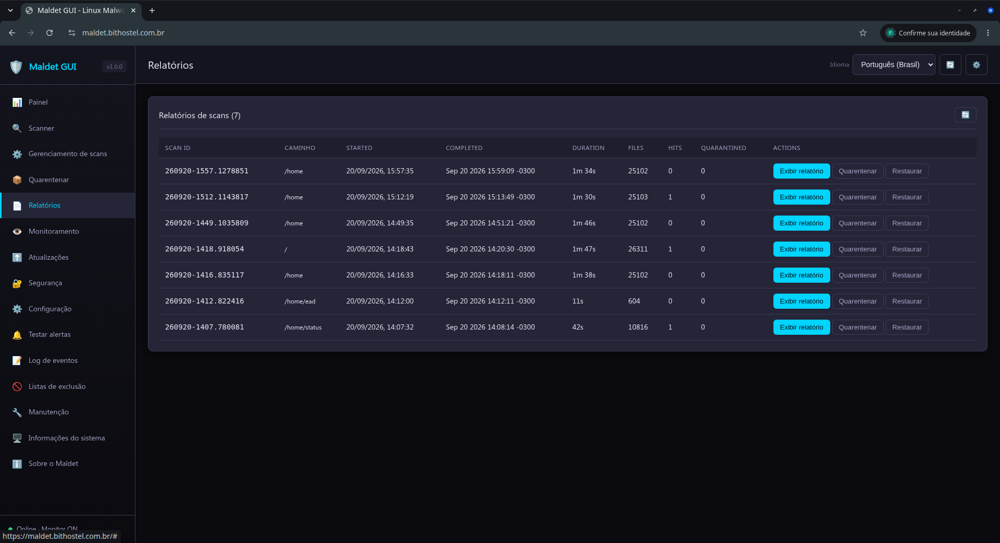

Em **Relatórios**, selecione um scan para conferir arquivos analisados,
detecções, ações executadas e o horário de término.

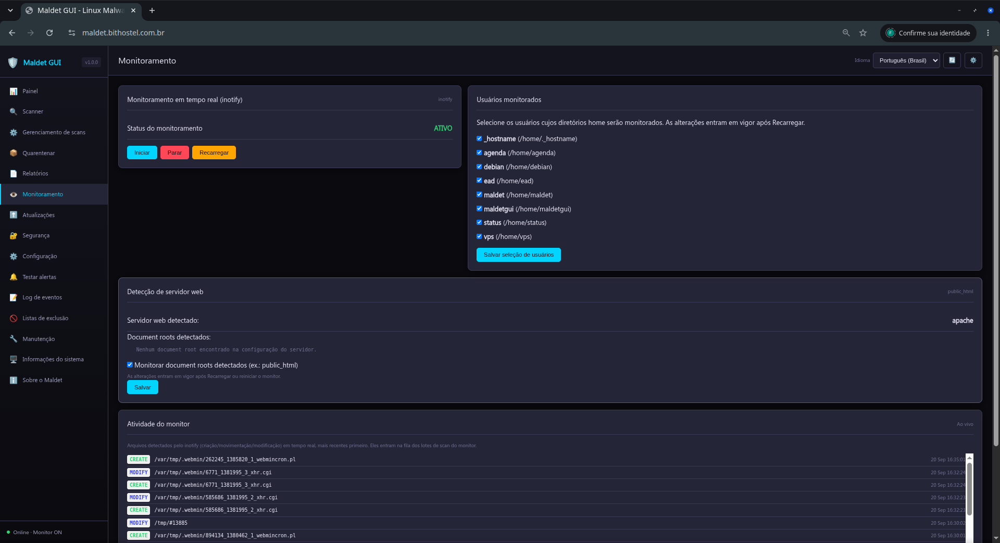

## 5. Monitoramento e atualizações

**Monitoramento** controla o monitor inotify e os diretórios acompanhados.
Use essa página para iniciar, parar ou recarregar o monitor.

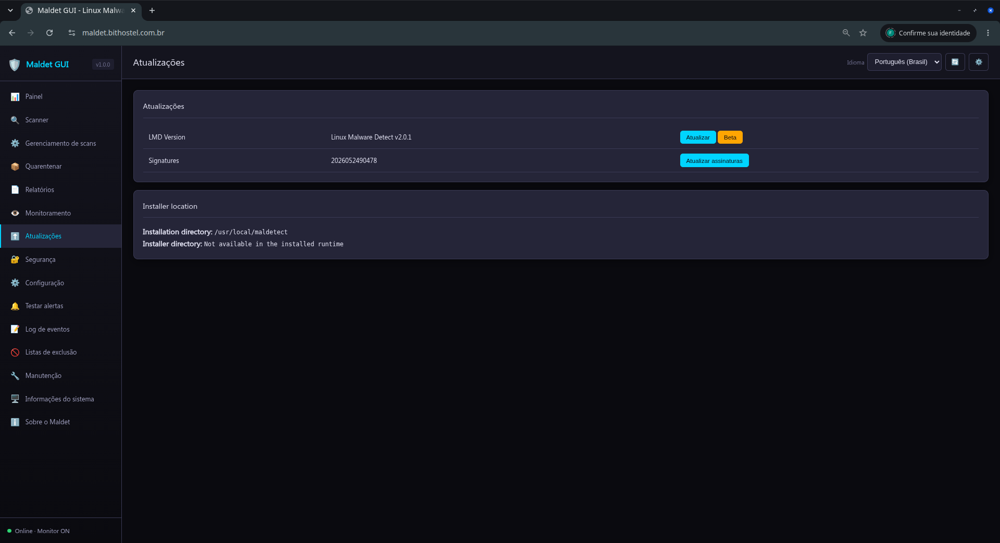

Em **Atualizações**, atualize as assinaturas do Maldet e, quando disponível,
o banco do ClamAV. Aguarde a mensagem de conclusão antes de fechar a página.

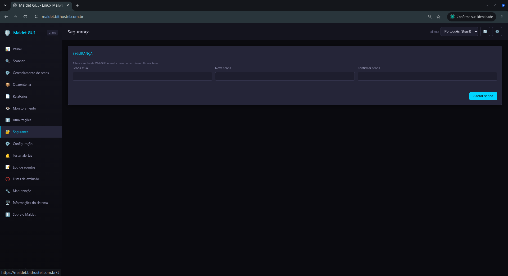

## 6. Segurança, configuração e alertas

Use **Segurança** para consultar e ajustar os controles de acesso da
interface. Em **Configuração**, altere somente opções conhecidas; mudanças de
workers, limites de CPU/IO, engine e alertas podem alterar o consumo do
servidor.

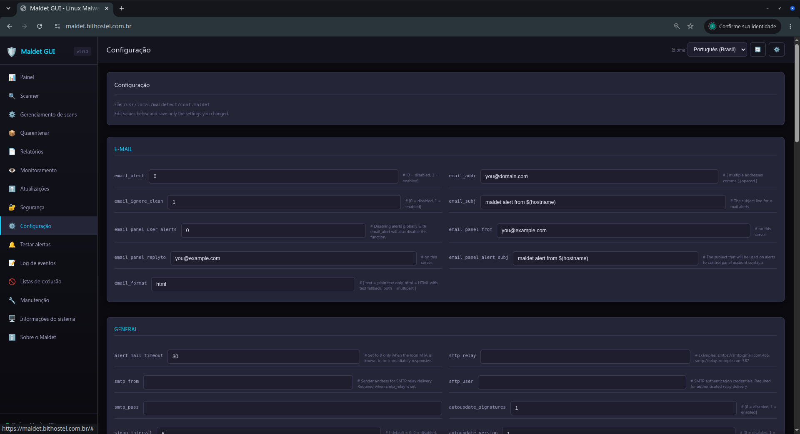

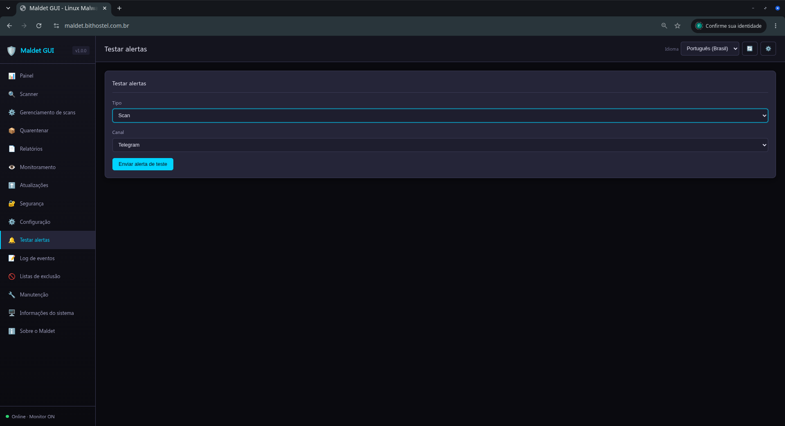

Em **Testar alertas**, selecione o canal e envie uma notificação de teste.
Nunca inclua tokens ou senhas em capturas de tela, logs ou chamados.

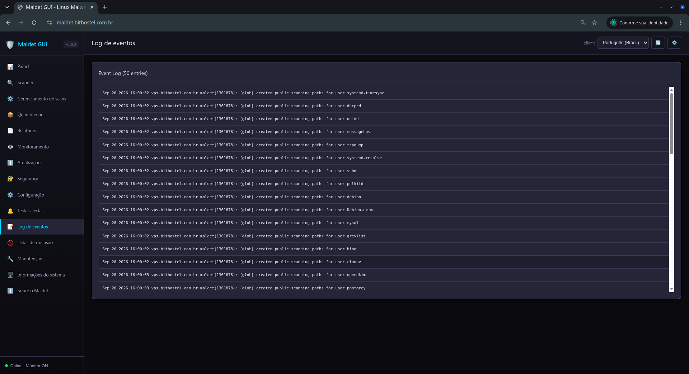

## 7. Logs, listas de exclusão e manutenção

O **Log de eventos** ajuda a diagnosticar início e término de scans, alertas,
erros e atualizações.

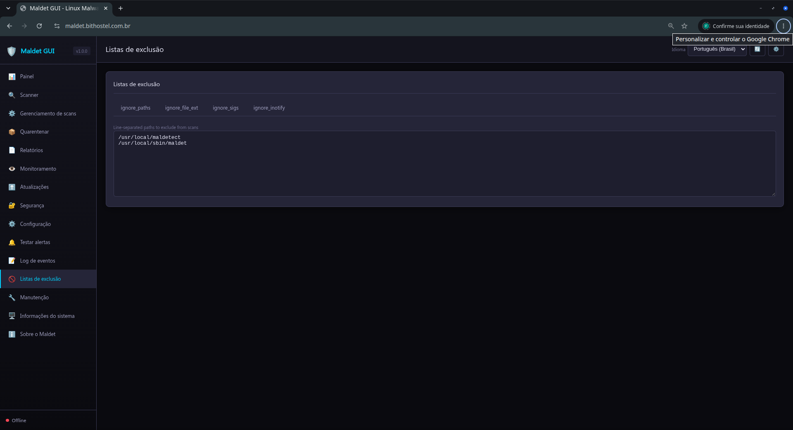

Use **Listas de exclusão** para ignorar caminhos, extensões ou regras
específicas. Prefira regras restritas para não ocultar uma detecção válida.

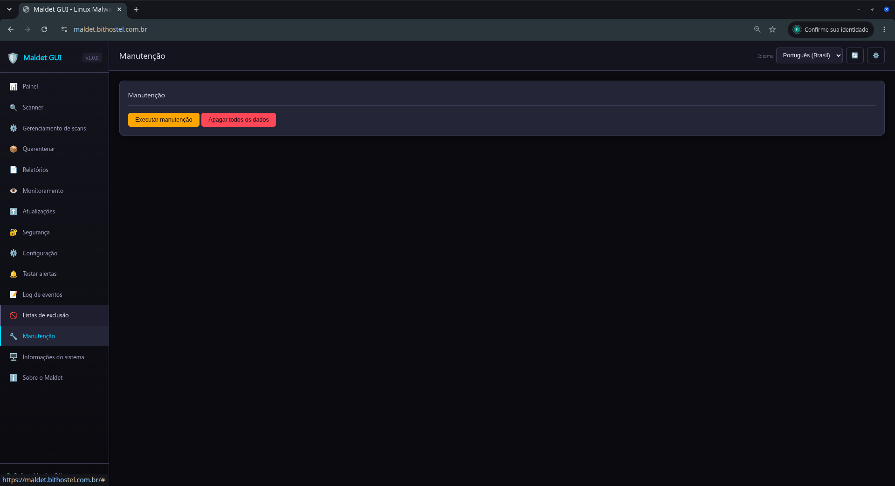

**Manutenção** organiza históricos, limpa metadados stale, comprime sessões
antigas e arquiva sessões antigas. Ela não inicia scans nem remove
automaticamente arquivos legítimos da quarentena.

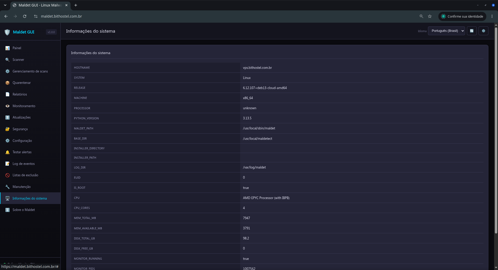

## 8. Informações e diagnóstico

**Informações do sistema** mostra hostname, sistema operacional, CPU, memória,
disco, caminhos de instalação e comandos detectados. Use esses dados ao
investigar uma falha ou solicitar suporte.

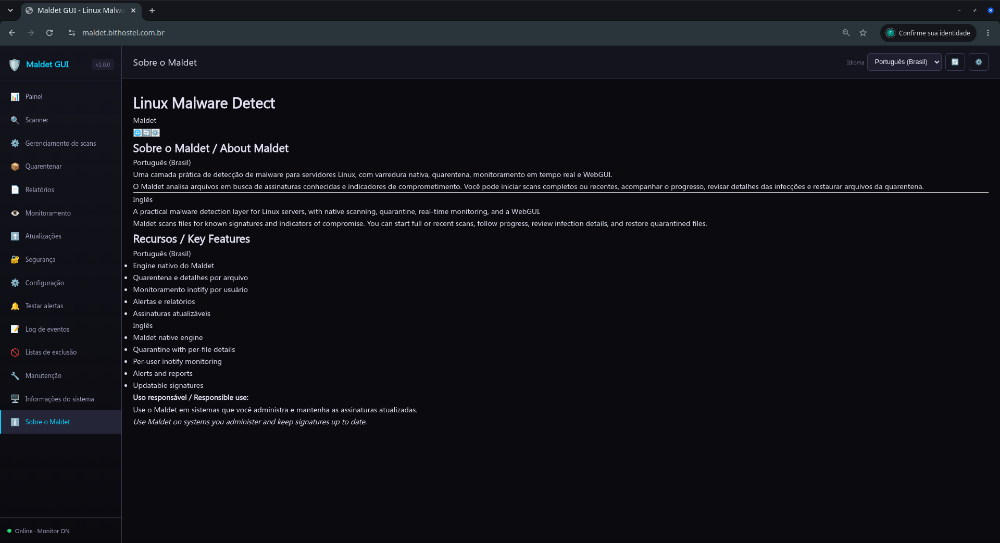

Se a interface ficar carregando, faça um recarregamento completo (`Ctrl+F5`),
confira o endpoint `/api/check` e verifique o log do launcher. Para acesso
remoto, prefira proxy reverso com autenticação e TLS; não exponha a porta
diretamente à internet.
